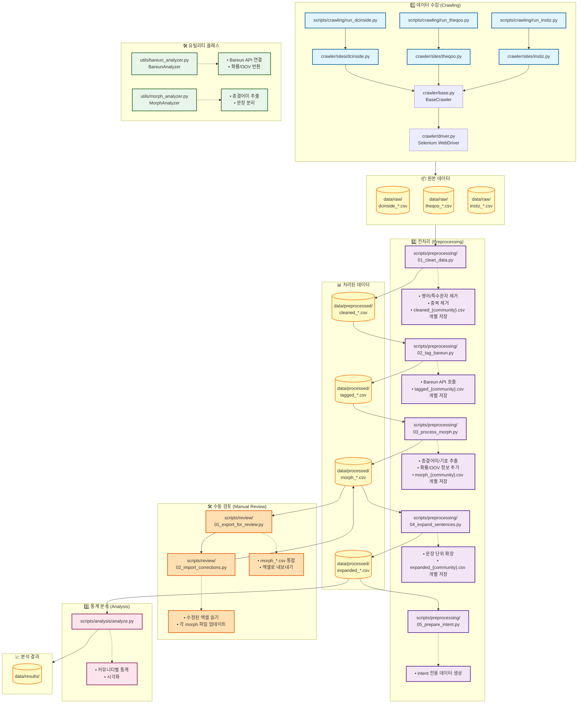

# 📁 KOR4001 국어학연습 개인 연구

젊은 세대가 사용하는 온라인 커뮤니티의 문장 종결 방식과 문형을 분석하여 커뮤니티별 방언 구획을 시도하는 연구입니다.

## 프로젝트 개요

- **목적**: 다양한 온라인 커뮤니티(DC Inside, TheQoo 등)의 게시글을 수집하여 종결 어미 사용 패턴 분석
- **주요 기술**: Python, Bareun 형태소 분석기, Selenium, Pandas, matplotlib
- **분석 방법**: 형태소 분석 → 종결 어미 추출 → 카이제곱 검정

## 데이터 처리 파이프라인



### 파이프라인 단계별 설명

#### 1️⃣ 데이터 수집 (Crawling)
- **입력**: 온라인 커뮤니티 웹페이지
- **처리**: Selenium을 통한 동적 웹 크롤링
- **출력**: `data/raw/*.csv` (커뮤니티별 원본 게시글)

#### 2️⃣ 전처리 (Preprocessing)

**Step 1: 데이터 정제** (`01_clean_data.py`)
- 영어/특수문자 제거, 중복 제거
- 커뮤니티별로 분리하여 저장
- **출력**: `data/preprocessed/cleaned_{community}.csv`

**Step 2: Bareun 태깅** (`02_tag_bareun.py`)
- 각 `cleaned_*.csv` 파일을 Bareun API로 형태소 분석
- **출력**: `data/processed/tagged_{community}.csv`

**Step 3: Morph 후처리** (`03_process_morph.py`)
- 종결어미, 문장부호 추출
- 확률(`min_prob`) 및 OOV(`has_oov`) 정보 계산
- 수동 검토 필요 여부(`needs_manual_intent`) 플래그 설정
- **출력**: `data/processed/morph_{community}.csv`

**Step 3.5: 수동 검토 (선택 사항)** (`scripts/review/`)
- `01_export_for_review.py`: 모든 `morph_*.csv`를 엑셀(`review_dataset.xlsx`)로 통합 추출
- 엑셀에서 `sentences_text` 수정 (엔터로 문장 분리 수정 등)
- `02_import_corrections.py`: 수정된 엑셀을 읽어 각 `morph_{community}.csv`에 반영

**Step 4: 문장 단위 확장** (`04_expand_sentences.py`)
- `morph_*.csv`의 JSON 결과를 파싱하여 문장 단위로 행 확장
- **출력**: `data/processed/expanded_{community}.csv`

**Step 5: Intent 정리** (`05_prepare_intent.py`)
- 최종 분석용 데이터 생성

#### 3️⃣ 통계 분석 (Analysis)
- 커뮤니티별 종결 어미 빈도 계산
- 문형 분포 비교
- 카이제곱 검정을 통한 통계적 유의성 검증
- matplotlib을 통한 시각화
## 프로젝트 구조

```
project/
├── README.md                    # 프로젝트 문서 (현재 파일)
├── requirements.txt             # Python 의존성
├── .env                         # 환경 변수 (API 키)
│
├── data/
│   ├── raw/                     # 원본 크롤링 데이터
│   ├── preprocessed/            # 정제된 데이터
│   ├── processed/               # 분석 준비 완료 데이터
│   └── results/                 # 분석 결과 (통계, 시각화)
│
├── scripts/
│   ├── crawling/                # 크롤링 스크립트
│   │   ├── run_dcinside.py
│   │   ├── run_theqoo.py
│   │   └── run_all.py
│   ├── preprocessing/           # 전처리 스크립트
│   │   ├── 01_clean_data.py     # 데이터 정제
│   │   ├── 02_tag_bareun.py     # Bareun 태깅
│   │   ├── 03_process_morph.py  # Morph 후처리 (종결어미/기호 추출)
│   │   ├── 04_expand_sentences.py # 문장 단위 확장
│   │   └── 05_prepare_intent.py # Intent 정리
│   └── analysis/                # 분석 스크립트
│       └── analyze.py           # 통계 분석 및 시각화
│
├── utils/                       # 유틸리티 라이브러리 (OOP)
│   ├── __init__.py
│   ├── bareun_analyzer.py       # BareunAnalyzer (Singleton)
│   ├── morph_analyzer.py        # MorphAnalyzer
│   └── data_pipeline.py         # (선택) DataPipeline 유틸
│
└── crawler/                     # 크롤러 라이브러리
    ├── base.py
    ├── sites/
    │   ├── dcinside.py
    │   ├── theqoo.py
    │   └── instiz.py
    └── ...
```

## 설치 방법

### 1. 저장소 클론
```bash
git clone <repository-url>
cd <project-directory>
```

### 2. 가상환경 생성 및 활성화
```bash
# 가상환경 생성
python3 -m venv .venv

# 가상환경 활성화
source .venv/bin/activate  # Mac/Linux
.venv\Scripts\activate  # Windows
```

### 3. 의존성 설치
```bash
pip install -r requirements.txt
```

> **중요**: 이후 모든 명령은 가상환경이 활성화된 상태에서 실행해야 합니다.
> - 가상환경 활성화 확인: 터미널 프롬프트 앞에 `(.venv)` 표시가 있어야 합니다.
> - 가상환경 비활성화: `deactivate` 명령 실행


### 4. 환경 변수 설정
`.env` 파일을 생성하고 다음 내용을 추가합니다:

```
BAREUN_API_KEY=your_bareun_api_key_here
```

> **참고**: Bareun API 키는 [Bareun AI](https://bareun.ai)에서 발급받을 수 있습니다.

## 핵심 라이브러리 (utils/)

프로젝트는 재사용 가능한 OOP 기반 유틸리티 클래스를 제공합니다:

### BareunAnalyzer (Singleton)
```python
from utils import BareunAnalyzer

analyzer = BareunAnalyzer()  # 어디서든 동일한 인스턴스 반환
result = analyzer.analyze("안녕하세요")
```
- Bareun API를 Singleton 패턴으로 관리
- 불필요한 재초기화 방지

### MorphAnalyzer
```python
from utils import MorphAnalyzer

analyzer = MorphAnalyzer()
endings = analyzer.extract_final_endings([["하", "EF"], ["시", "EC"]])
punctuation, symbols = analyzer.extract_symbols("좋아?? ㅎㅎ")
```
- Bareun 결과 토큰을 기반으로 종결 어미 추출
- 반복된 감정 표현(ㅋ/ㅎ, ㅠ/ㅜ)과 문장부호(?!, !!, …) 추출
- `split_sentences`로 줄바꿈/공백을 고려한 문장 분리 보조 기능 제공
- `is_banmal`을 통해 종결어미 기반 반말 판단 참고 가능

## 사용 방법

### 전체 파이프라인 실행

#### 1. 데이터 크롤링 (선택 사항)
이미 `data/raw/`에 데이터가 있다면 이 단계는 건너뛸 수 있습니다.

```bash
# 특정 사이트 크롤링 (기본값: 각 갤러리/보드당 100페이지)
python scripts/crawling/run_dcinside.py
python scripts/crawling/run_theqoo.py

# 크롤링 페이지 수 조절 (예: 각 갤러리/보드당 50페이지)
python scripts/crawling/run_dcinside.py --max-pages 50
python scripts/crawling/run_theqoo.py --max-pages 50

# 또는 전체 크롤링
python scripts/crawling/run_all.py
```

**크롤링 옵션**:
- `--max-pages`: 각 갤러리/보드에서 크롤링할 최대 페이지 수 (기본값: 100)
  - DC Inside: 1페이지당 약 50개 게시글
  - TheQoo: 1페이지당 약 20개 게시글
  - 예시: `--max-pages 100` → DC Inside는 약 5,000개, TheQoo는 약 2,000개 게시글 수집

> **참고**: 
> - 페이지 수가 많을수록 크롤링 시간이 길어집니다.
> - 과도한 요청은 IP 차단을 유발할 수 있으므로 주의하세요.
> - 크롤링은 해당 사이트의 이용 약관을 준수해야 합니다.


#### 2. 데이터 정제
```bash
python scripts/preprocessing/01_clean_data.py
```

**수행 작업**:
- 영어/특수문자 제거, 중복 제거
- 커뮤니티별로 분리하여 저장
- 출력: `data/preprocessed/cleaned_{community}.csv`

#### 3. Bareun 태깅
```bash
python scripts/preprocessing/02_tag_bareun.py
# 특정 갤러리만 처리하려면:
python scripts/preprocessing/02_tag_bareun.py --gallery "수능"
```

**수행 작업**:
- Bareun API 호출로 각 문장을 토크나이즈
- `sentence_segments` 컬럼에 JSON 문자열로 `[{"sentence": "...", "tokens": [[morph, tag], ...]}, ...]` 저장
- 출력: `data/processed/tagged_{community}.csv`

#### 4. Morph 후처리
```bash
python scripts/preprocessing/03_process_morph.py

# 대화형 모드 (모호한 태그 수동 검토) + 특정 갤러리 필터:
python scripts/preprocessing/03_process_morph.py --interactive --gallery "수능"
```

**수행 작업**:
- `sentence_segments`에서 `MorphAnalyzer`로 종결어미/문장부호/감정 기호 추출
- **자동 보정 규칙 적용**:
  - `ETN`('ㅁ', '음') 뒤에 조사가 없으면 `EF`로 자동 변환
  - 문장 끝(또는 문장부호 앞)의 `EC`는 `ECF`로 자동 변환
  - `긔`, `노` (확률 0.9 이하)는 `EF`로 자동 변환
- **대화형 모드 (`--interactive`)**:
  - 모호한 태그(확률 낮은 EC, ETN, '임' 등)에 대해 사용자에게 확인 요청
  - 옵션: `[e]` EF로 변경, `[k]` 유지, `[c]` 직접 입력, `[d]` 문장 삭제, `[s]` 건너뛰기
  - **이어하기(Resume)**: 작업 중단 시 `.partial.csv` 파일을 감지하여 자동으로 이어서 진행
- **중복 제거**: 문장 내용이 중복되는 행 자동 제거
- 출력: `data/processed/morph_{community}.csv`

#### 4.5. 수동 검토 (선택 사항)
문장 분리 오류나 분석 결과를 수정하고 싶을 때 사용합니다.

1. **검토용 파일 생성**:
   ```bash
   python scripts/review/01_export_for_review.py
   ```
   - `data/review/review_dataset.xlsx` 생성됨.

2. **엑셀 수정**:
   - `sentences_text` 컬럼에서 문장을 엔터(줄바꿈)로 구분하여 수정.
   - 필요시 `review_dataset_corrected.xlsx`로 저장.

3. **수정 사항 반영**:
   ```bash
   python scripts/review/02_import_corrections.py
   ```
   - 수정된 내용을 원본 `morph_{community}.csv` 파일들에 반영.

#### 5. 문장 단위 확장
```bash
python scripts/preprocessing/04_expand_sentences.py
# 특정 갤러리만 처리하려면:
python scripts/preprocessing/04_expand_sentences.py --gallery "수능"
```

**수행 작업**:
- `sentence_results` JSON 파싱
- 각 문장을 개별 행으로 확장
- 출력: `data/processed/expanded_{community}.csv`

#### 6. 통계 분석 및 시각화
```bash
python scripts/analysis/analyze.py
```

**수행 작업**:
- 커뮤니티별 통계 계산
- 종결 어미 및 문형(평서형, 의문형 등) 빈도 분석
- 카이제곱 검정 및 시각화
- 출력: `data/results/` 폴더

## 주요 결과물

분석 완료 후 `data/results/` 폴더에 다음 파일들이 생성됩니다:

- `community_stats.csv`: 커뮤니티별 게시글 수, 종결 어미 수 등
- `top_endings_by_community.png`: 커뮤니티별 상위 종결 어미 시각화
- `specific_endings_distribution.png`: 특정 어미 분포 비교
- `stats_result.txt`: 카이제곱 검정 결과

## 크롤러 사용법

### DC Inside
```python
from crawler.sites.dcinside import DCInsideScraper

scraper = DCInsideScraper()
posts = scraper.scrape_gallery("해외축구_갤러리", max_posts=5000)
scraper.save_to_csv(posts, "dcinside_해외축구_갤러리")
```

### TheQoo
```python
from crawler.sites.theqoo import TheQooScraper

scraper = TheQooScraper()
posts = scraper.scrape_category("beauty", category_id="25604", max_posts=2000)
scraper.save_to_csv(posts, "theqoo_beauty_category_25604")
```

## 문제 해결

### Bareun API 연결 실패
- `.env` 파일에 `BAREUN_API_KEY`가 설정되어 있는지 확인
- API 키가 유효한지 확인
- 인터넷 연결 상태 확인

### 크롤링 오류
- Selenium WebDriver가 설치되어 있는지 확인
- Chrome 브라우저 버전과 ChromeDriver 버전 호환성 확인
- 사이트 구조가 변경되었을 수 있으므로 크롤러 코드 업데이트 필요

### 한글 폰트 문제 (matplotlib)
Mac의 경우 'AppleGothic', Windows의 경우 'Malgun Gothic' 등으로 설정 변경

## 프로젝트 정보
- 2025-2학기 국어학연습(KOR4001) 기말 개인 연구
- 연구 기간: 2025년 11월 1일 ~ 2025년 12월 26일
- 연구자: 서강대학교 국어국문학과 22학번 김현서 (neulbokim@sogang.ac.kr)
- 지도교수: 서강대학교 국어국문학과 김한별 교수 (hbkim@sogang.ac.kr)
